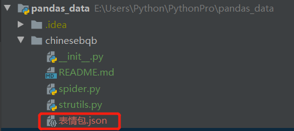

# chinesebqb

爬取表情包网站的表情包数据，爬取的数据会存放在当前目录下的json文件中。

> `https://www.v2fy.com/p/000readme-chinesebqb/`

运行`spider.py`程序会得到上面的json文件。
为了项目的简洁性，这里在上传的时候会删除掉。

### 代码实现

参考：[爬取颜色网站的颜色数据][1]

[1]:https://github.com/yueyue10/PythonPro/tree/master/pandas_data/color
