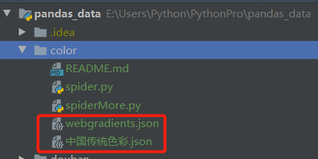

# color
爬取颜色网站的颜色数据，爬取的数据会存放在当前目录下的json文件中。

> `https://www.sojson.com/web/cj.html`



运行`spider.py`和`spiderMore.py`程序会得到上面的json文件。
为了项目的简洁性，这里在上传的时候会删除掉。

### 核心代码

使用第三方库 **`lxml`** 的`etree`实现

大概思想
> 1. 使用`etree.HTML(html内容)`方法创建`html`对象

> 2. 通过上面创建的`html`对象的`xpath`方法来逐层查找控件及查找控件属性或内容

> 3. 使用获取到的数据创建颜色对象`ColorListBean`

> 4. 再通过`json.dumps()`方法将对象转成JSON字符串`jsonStr`

> 5. 最后通过文件的`open()`及`write()`方法将`jsonStr`写入文件中

```
def start(self):
    colorListBean = self.get_info_from_colors(self.url)
    colorListBean_json = json.dumps(colorListBean, default=lambda obj: obj.__dict__, sort_keys=True, indent=4)
    self.save_json_in_json(colorListBean.title, colorListBean_json)
    print(colorListBean_json)

# 获取颜色数据
def get_info_from_colors(self, href):
    html_detail = self.get_html_text(href)
    com_html = etree.HTML(html_detail)
    chinaColor = com_html.xpath('//*[@id="chinacolor"]/ul')
    colorList = []
    for index, colorUl in enumerate(chinaColor):
        colorLi = colorUl.xpath('./li')
        for colorItem in colorLi:
            colorName = colorItem.xpath('./a/text()')[0]
            colorValue = colorItem.xpath('./a/span/text()')[0]
            print(colorName, colorValue)
            colorBean = ColorBean(colorName, colorValue)
            colorList.append(colorBean)
    colorListBean = ColorListBean("中国传统色彩", colorList)
    return colorListBean

# 保存json数据到json文件中
@staticmethod
def save_json_in_json(name, jsonstr):
    with open('{}.json'.format(name), 'w') as f:
        # json.dump(jsonstr, f, ensure_ascii=False)
        f.write(jsonstr)
```
